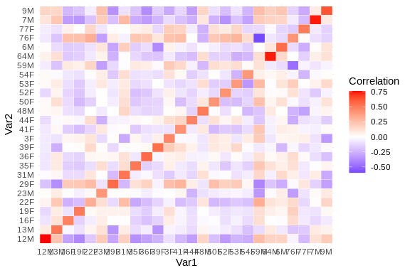

56 - Matrix Synergy
================
Steven Roberts
11 September, 2023

- <a href="#1-will-redo-methylation-to-get-all-samples"
  id="toc-1-will-redo-methylation-to-get-all-samples">1 Will Redo
  methylation to get all samples..</a>
  - <a href="#11-sample-metadata" id="toc-11-sample-metadata">1.1 sample
    metadata</a>
- <a href="#2-checking-for-consistency"
  id="toc-2-checking-for-consistency">2 checking for consistency</a>
- <a href="#3-checking-for-consistency"
  id="toc-3-checking-for-consistency">3 checking for consistency</a>
- <a href="#4-correlation" id="toc-4-correlation">4 correlation</a>

We have a few matrices comparing samples but the are not directly
comparable.

Currently we have SNP data like this..


<https://github.com/sr320/ceabigr/blob/main/output/53-revisit-epi-SNPs/epiMATRIX_mbd_rab.txt>

Gene expression data like this..


Methylation like ..


# 1 Will Redo methylation to get all samples..

## 1.1 sample metadata

| Sample.ID | OldSample.ID | Treatment | Sex | TreatmentN | Parent.ID |
|:----------|:-------------|:----------|:----|:-----------|:----------|
| 12M       | S12M         | Exposed   | M   | 3          | EM05      |
| 13M       | S13M         | Control   | M   | 1          | CM04      |
| 16F       | S16F         | Control   | F   | 2          | CF05      |
| 19F       | S19F         | Control   | F   | 2          | CF08      |
| 22F       | S22F         | Exposed   | F   | 4          | EF02      |
| 23M       | S23M         | Exposed   | M   | 3          | EM04      |
| 29F       | S29F         | Exposed   | F   | 4          | EF07      |
| 31M       | S31M         | Exposed   | M   | 3          | EM06      |
| 35F       | S35F         | Exposed   | F   | 4          | EF08      |
| 36F       | S36F         | Exposed   | F   | 4          | EF05      |
| 39F       | S39F         | Control   | F   | 2          | CF06      |
| 3F        | S3F          | Exposed   | F   | 4          | EF06      |
| 41F       | S41F         | Exposed   | F   | 4          | EF03      |
| 44F       | S44F         | Control   | F   | 2          | CF03      |
| 48M       | S48M         | Exposed   | M   | 3          | EM03      |
| 50F       | S50F         | Exposed   | F   | 4          | EF01      |
| 52F       | S52F         | Control   | F   | 2          | CF07      |
| 53F       | S53F         | Control   | F   | 2          | CF02      |
| 54F       | S54F         | Control   | F   | 2          | CF01      |
| 59M       | S59M         | Exposed   | M   | 3          | EM01      |
| 64M       | S64M         | Control   | M   | 1          | CM05      |
| 6M        | S6M          | Control   | M   | 1          | CM02      |
| 76F       | S76F         | Control   | F   | 2          | CF04      |
| 77F       | S77F         | Exposed   | F   | 4          | EF04      |
| 7M        | S7M          | Control   | M   | 1          | CM01      |
| 9M        | S9M          | Exposed   | M   | 3          | EM02      |

``` bash
cd ../data/big

curl -O https://gannet.fish.washington.edu/seashell/bu-github/2018_L18-adult-methylation/analyses/myobj_oa
```

``` r
filtered.myobj=filterByCoverage(myobj_oa,lo.count=10,lo.perc=NULL,
                                      hi.count=NULL,hi.perc=98)

meth_filter=unite(filtered.myobj, min.per.group=NULL, destrand=TRUE)

clusterSamples(meth_filter, dist="correlation", method="ward", plot=TRUE)


PCASamples(meth_filter)
```

Laura’s code

``` r
perc.meth=percMethylation(meth_filter, rowids=T)
```

``` r
#Save % methylation df to object and .tab file 
save(perc.meth, file = "../output/56-matrix-synergy/all-perc.meth") #save object to file 
```

``` r
load(file = "../output/56-matrix-synergy/all-perc.meth") #load object if needed
```

``` r
#write.table((as.data.frame(perc.meth) %>% tibble::rownames_to_column("contig")), file = "../output/55-methylation-matrix/male-perc.meth.tab", sep = '\t', na = "NA", row.names = FALSE, col.names = TRUE)
```

``` r
perc.meth_T <- t(perc.meth)
```

``` r
correlationMatrix <- cor(perc.meth_T)
```

``` r
distanceMatrix <- dist(perc.meth_T)
```

``` r
# Convert distance matrix to a regular matrix
matrixForm <- as.matrix(distanceMatrix)

# Display the matrix
print(matrixForm)
```

    ##          12M      13M      16F      19F      22F      23M      29F      31M
    ## 12M     0.00 23304.01 30773.35 29629.70 30346.25 23098.58 31184.73 23129.98
    ## 13M 23304.01     0.00 31014.11 29879.93 30587.51 23344.65 30795.72 23356.35
    ## 16F 30773.35 31014.11     0.00 21908.45 22130.65 31511.83 21954.90 31138.59
    ## 19F 29629.70 29879.93 21908.45     0.00 21383.26 30272.65 21751.81 30048.86
    ## 22F 30346.25 30587.51 22130.65 21383.26     0.00 31126.69 21748.06 30843.14
    ## 23M 23098.58 23344.65 31511.83 30272.65 31126.69     0.00 31986.18 23189.74
    ## 29F 31184.73 30795.72 21954.90 21751.81 21748.06 31986.18     0.00 31192.70
    ## 31M 23129.98 23356.35 31138.59 30048.86 30843.14 23189.74 31192.70     0.00
    ## 35F 29283.62 29464.21 22231.28 21656.49 21939.90 29955.70 22065.75 29655.75
    ## 36F 29251.41 29474.21 22292.71 21511.49 21806.09 29935.49 22170.41 29648.06
    ## 39F 29579.97 29236.69 22057.29 21624.73 21906.64 30199.07 21423.26 29902.22
    ## 3F  31919.23 31853.28 22432.76 21911.40 22252.87 32447.18 21904.46 31683.66
    ## 41F 32063.83 32161.13 22808.30 22031.13 22128.82 32830.28 22217.91 32443.45
    ## 44F 31068.04 31178.57 21399.95 21324.27 21368.22 31540.12 20634.29 31412.10
    ## 48M 22942.88 22983.32 30990.10 29744.86 30423.65 22483.58 31359.26 23310.80
    ## 50F 30802.18 30925.90 22163.84 21635.20 21877.25 31438.81 21873.67 31145.29
    ## 52F 32363.67 32560.67 22081.44 22468.54 22479.71 33105.26 22489.10 32763.03
    ## 53F 29715.85 29916.97 22096.18 21609.50 21920.39 30529.01 21910.00 30078.30
    ## 54F 30263.18 30218.75 21707.26 21245.89 21462.58 30907.61 21081.23 30618.47
    ## 59M 23373.46 22750.43 31684.28 30506.55 31287.24 21719.67 31365.02 23638.96
    ## 64M 23109.80 23470.15 31088.76 29805.08 30607.09 23134.88 31270.04 23368.54
    ## 6M  22788.21 22821.71 31009.81 29855.33 30526.70 23003.41 31223.09 23359.32
    ## 76F 28416.24 28133.35 22821.71 21997.49 22735.05 28182.87 22293.72 28600.92
    ## 77F 29508.27 29423.39 22009.22 21394.53 21836.51 29941.71 21642.05 29756.03
    ## 7M  23029.43 23402.97 31265.45 30162.05 30724.11 23068.02 31741.13 23465.14
    ## 9M  22958.67 23244.69 31048.02 29908.63 30620.98 23214.31 31179.96 22945.08
    ##          35F      36F      39F       3F      41F      44F      48M      50F
    ## 12M 29283.62 29251.41 29579.97 31919.23 32063.83 31068.04 22942.88 30802.18
    ## 13M 29464.21 29474.21 29236.69 31853.28 32161.13 31178.57 22983.32 30925.90
    ## 16F 22231.28 22292.71 22057.29 22432.76 22808.30 21399.95 30990.10 22163.84
    ## 19F 21656.49 21511.49 21624.73 21911.40 22031.13 21324.27 29744.86 21635.20
    ## 22F 21939.90 21806.09 21906.64 22252.87 22128.82 21368.22 30423.65 21877.25
    ## 23M 29955.70 29935.49 30199.07 32447.18 32830.28 31540.12 22483.58 31438.81
    ## 29F 22065.75 22170.41 21423.26 21904.46 22217.91 20634.29 31359.26 21873.67
    ## 31M 29655.75 29648.06 29902.22 31683.66 32443.45 31412.10 23310.80 31145.29
    ## 35F     0.00 22013.48 21863.41 22476.44 23001.00 21806.94 29461.33 22206.57
    ## 36F 22013.48     0.00 21946.62 22265.72 22625.56 21727.24 29237.54 22039.75
    ## 39F 21863.41 21946.62     0.00 22223.98 22783.80 21444.18 29546.26 22094.86
    ## 3F  22476.44 22265.72 22223.98     0.00 22331.44 21401.95 31986.42 22021.11
    ## 41F 23001.00 22625.56 22783.80 22331.44     0.00 21778.71 32225.97 21921.02
    ## 44F 21806.94 21727.24 21444.18 21401.95 21778.71     0.00 31055.08 21422.94
    ## 48M 29461.33 29237.54 29546.26 31986.42 32225.97 31055.08     0.00 30972.88
    ## 50F 22206.57 22039.75 22094.86 22021.11 21921.02 21422.94 30972.88     0.00
    ## 52F 22885.74 22929.15 22604.14 22616.16 23005.97 21831.33 32573.71 22538.13
    ## 53F 21911.35 21903.17 21895.49 22009.51 22388.48 21503.49 29991.58 21826.59
    ## 54F 21600.18 21442.54 21312.10 21646.93 22041.85 20586.03 30095.88 21371.09
    ## 59M 30049.34 30070.87 30074.60 32655.96 33083.72 31343.95 22089.64 31665.59
    ## 64M 29515.73 29439.19 29731.60 31980.40 32138.93 31173.58 22999.28 30930.63
    ## 6M  29538.67 29424.15 29381.81 32092.12 32304.58 31281.94 22890.16 31055.19
    ## 76F 22279.71 22178.59 21720.06 22850.60 23668.90 21542.05 28105.05 22620.45
    ## 77F 21759.72 21715.88 21211.64 22177.69 22708.95 21159.08 29112.22 22171.96
    ## 7M  29702.59 29743.46 30021.30 32418.32 32604.45 31613.32 22890.79 31317.87
    ## 9M  29555.82 29228.70 29783.48 31724.89 32318.57 31117.51 22928.40 31126.25
    ##          52F      53F      54F      59M      64M       6M      76F      77F
    ## 12M 32363.67 29715.85 30263.18 23373.46 23109.80 22788.21 28416.24 29508.27
    ## 13M 32560.67 29916.97 30218.75 22750.43 23470.15 22821.71 28133.35 29423.39
    ## 16F 22081.44 22096.18 21707.26 31684.28 31088.76 31009.81 22821.71 22009.22
    ## 19F 22468.54 21609.50 21245.89 30506.55 29805.08 29855.33 21997.49 21394.53
    ## 22F 22479.71 21920.39 21462.58 31287.24 30607.09 30526.70 22735.05 21836.51
    ## 23M 33105.26 30529.01 30907.61 21719.67 23134.88 23003.41 28182.87 29941.71
    ## 29F 22489.10 21910.00 21081.23 31365.02 31270.04 31223.09 22293.72 21642.05
    ## 31M 32763.03 30078.30 30618.47 23638.96 23368.54 23359.32 28600.92 29756.03
    ## 35F 22885.74 21911.35 21600.18 30049.34 29515.73 29538.67 22279.71 21759.72
    ## 36F 22929.15 21903.17 21442.54 30070.87 29439.19 29424.15 22178.59 21715.88
    ## 39F 22604.14 21895.49 21312.10 30074.60 29731.60 29381.81 21720.06 21211.64
    ## 3F  22616.16 22009.51 21646.93 32655.96 31980.40 32092.12 22850.60 22177.69
    ## 41F 23005.97 22388.48 22041.85 33083.72 32138.93 32304.58 23668.90 22708.95
    ## 44F 21831.33 21503.49 20586.03 31343.95 31173.58 31281.94 21542.05 21159.08
    ## 48M 32573.71 29991.58 30095.88 22089.64 22999.28 22890.16 28105.05 29112.22
    ## 50F 22538.13 21826.59 21371.09 31665.59 30930.63 31055.19 22620.45 22171.96
    ## 52F     0.00 22619.24 22269.99 33291.68 32613.68 32578.74 23697.28 22652.05
    ## 53F 22619.24     0.00 20850.13 30789.88 29919.82 30063.84 22370.49 21719.54
    ## 54F 22269.99 20850.13     0.00 30695.49 30366.81 30475.49 21760.94 20823.23
    ## 59M 33291.68 30789.88 30695.49     0.00 23189.99 23272.60 27812.48 29895.81
    ## 64M 32613.68 29919.82 30366.81 23189.99     0.00 23192.01 28615.15 29621.81
    ## 6M  32578.74 30063.84 30475.49 23272.60 23192.01     0.00 28373.61 29473.32
    ## 76F 23697.28 22370.49 21760.94 27812.48 28615.15 28373.61     0.00 21258.78
    ## 77F 22652.05 21719.54 20823.23 29895.81 29621.81 29473.32 21258.78     0.00
    ## 7M  32871.65 30334.13 30679.36 23290.29 23120.35 22998.42 28973.02 29872.25
    ## 9M  32641.74 30154.49 30400.04 23362.47 23315.06 22998.20 28502.96 29486.18
    ##           7M       9M
    ## 12M 23029.43 22958.67
    ## 13M 23402.97 23244.69
    ## 16F 31265.45 31048.02
    ## 19F 30162.05 29908.63
    ## 22F 30724.11 30620.98
    ## 23M 23068.02 23214.31
    ## 29F 31741.13 31179.96
    ## 31M 23465.14 22945.08
    ## 35F 29702.59 29555.82
    ## 36F 29743.46 29228.70
    ## 39F 30021.30 29783.48
    ## 3F  32418.32 31724.89
    ## 41F 32604.45 32318.57
    ## 44F 31613.32 31117.51
    ## 48M 22890.79 22928.40
    ## 50F 31317.87 31126.25
    ## 52F 32871.65 32641.74
    ## 53F 30334.13 30154.49
    ## 54F 30679.36 30400.04
    ## 59M 23290.29 23362.47
    ## 64M 23120.35 23315.06
    ## 6M  22998.42 22998.20
    ## 76F 28973.02 28502.96
    ## 77F 29872.25 29486.18
    ## 7M      0.00 22970.83
    ## 9M  22970.83     0.00

``` r
heatmap(matrixForm, Rowv = NA, Colv = NA, col = cm.colors(256), scale = "none")
```

``` r
dataFrameForm <- as.data.frame(matrixForm)
print(dataFrameForm)
```

``` r
write.table((as.data.frame(matrixForm) %>% tibble::rownames_to_column("sample")), file = "../output/56-matrix-synergy/all.meth-distance.tab", sep = '\t', na = "NA", row.names = FALSE, col.names = TRUE)
```

# 2 checking for consistency

text file..

``` bash
head -2 ../output/56-matrix-synergy/all.meth-distance.tab
```

    ## "sample" "12M"   "13M"   "16F"   "19F"   "22F"   "23M"   "29F"   "31M"   "35F"   "36F"   "39F"   "3F"    "41F"   "44F"   "48M"   "50F"   "52F"   "53F"   "54F"   "59M"   "64M"   "6M"    "76F"   "77F"   "7M"    "9M"
    ## "12M"    0   23304.0069449018    30773.3548066289    29629.7022439496    30346.249437145 23098.5830496124    31184.7314314988    23129.978377816 29283.6227675114    29251.4098948392    29579.9714132613    31919.2256764399    32063.8313572642    31068.0409488934    22942.8760393046    30802.1750112176    32363.6733837327    29715.84843474  30263.1784448872    23373.4562991821    23109.804844686 22788.2103589562    28416.2384891171    29508.2720313387    23029.4325530648    22958.6680752021

``` bash
head -2 ../output/53-revisit-epi-SNPs/epiMATRIX_mbd_rab.txt
```

    ## "sample" "12M"   "13M"   "16F"   "19F"   "22F"   "23M"   "29F"   "31M"   "35F"   "36F"   "39F"   "3F"    "41F"   "44F"   "48M"   "50F"   "52F"   "53F"   "54F"   "59M"   "64M"   "6M"    "76F"   "77F"   "7M"    "9M"
    ## "12M"    0   0.051833    0.065087    0.074943    0.052083    0.056348    0.063667    0.057863    0.072606    0.067544    0.061042    0.042357    0.057715    0.067394    0.059371    0.055395    0.067694    0.060491    0.061507    0.050297    0.058001    0.059446    0.044517    0.058163    0.06416 0.055671

# 3 checking for consistency

matrices..

``` r
load(file = "../output/53-revisit-epi-SNPs/distrab") #load object if needed
```

``` r
str(matrixForm)
```

    ##  num [1:26, 1:26] 0 23304 30773 29630 30346 ...
    ##  - attr(*, "dimnames")=List of 2
    ##   ..$ : chr [1:26] "12M" "13M" "16F" "19F" ...
    ##   ..$ : chr [1:26] "12M" "13M" "16F" "19F" ...

``` r
str(distrab)
```

    ##  num [1:26, 1:26] 0 0.0518 0.0651 0.0749 0.0521 ...
    ##  - attr(*, "dimnames")=List of 2
    ##   ..$ : chr [1:26] "12M" "13M" "16F" "19F" ...
    ##   ..$ : chr [1:26] "12M" "13M" "16F" "19F" ...

# 4 correlation

``` r
cor_matrix <- cor(matrixForm,distrab)
```

``` r
heatmap(cor_matrix)
```


``` r
# Create a data frame from the correlation matrix
cor_melted <- as.data.frame(as.table(cor_matrix))

# Create the heatmap
ggplot(data=cor_melted, aes(x=Var1, y=Var2)) +
  geom_tile(aes(fill=Freq), color='white') +
  scale_fill_gradient2(low="blue", high="red", mid="white", midpoint=0) +
 # geom_text(aes(label=sprintf("%.2f", Freq)), vjust=1) +
  theme_minimal() +
  labs(fill="Correlation")
```


