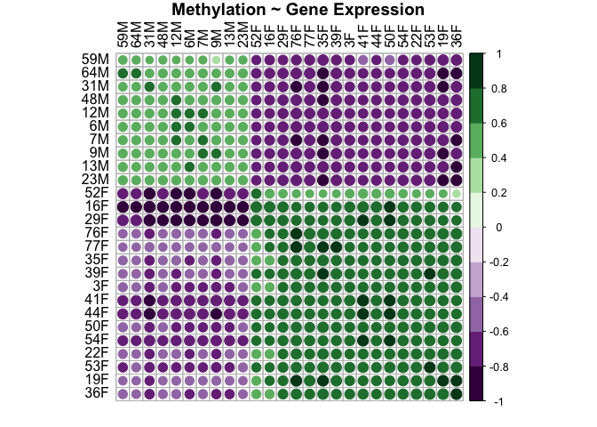
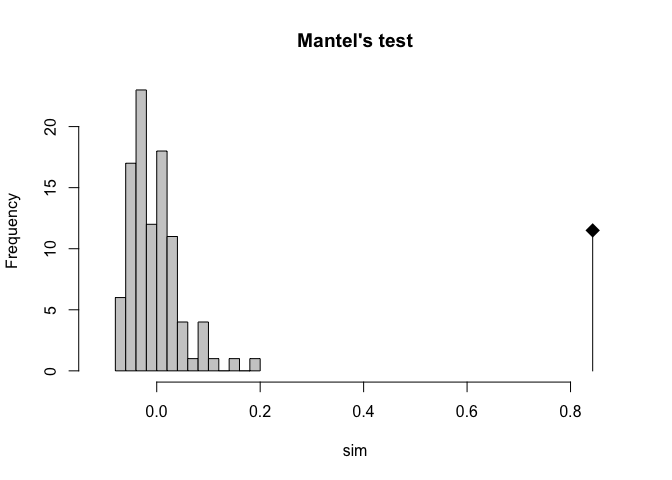
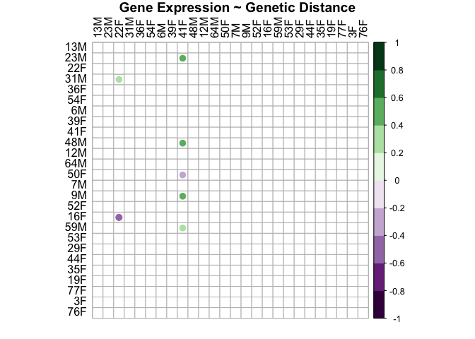
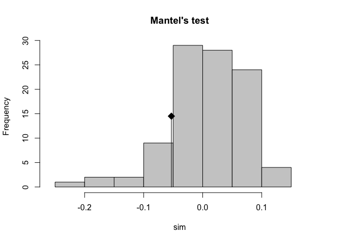
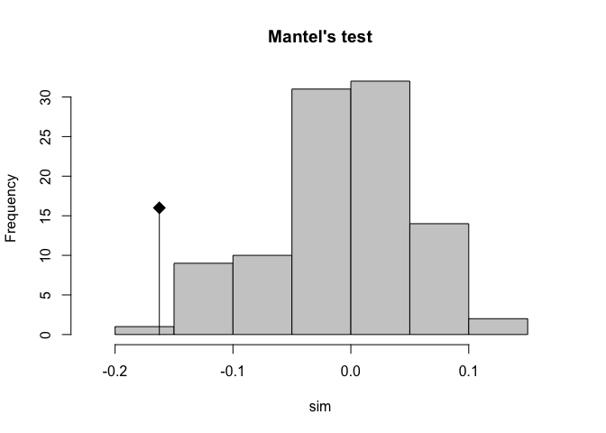

Genes-SNPs-methylation correlation
================
2023-09-29

# Set knit

# Load packages

``` r
library(ade4)
library(tidyverse)
library(Hmisc)
library(corrplot)
library(psych)
library(cowplot)
```

# Load data

Gene expression

``` r
genes<-read_csv("output/52.1-rnaseq-relatedness/gene-distance-matrix.csv")

genes<-as.matrix(genes)

rownames(genes)<-genes[,1]

genes <- genes[,-1]

# Remove "S" from row names and column names
new_row_names <- gsub("S", "", rownames(genes))
new_col_names <- gsub("S", "", colnames(genes))

# Set the updated row and column names
rownames(genes) <- new_row_names
colnames(genes) <- new_col_names

#convert to numeric
char_to_numeric_matrix <- function(char_matrix) {
  numeric_matrix <- as.data.frame(char_matrix)  # Convert to data frame
  numeric_matrix <- as.matrix(sapply(numeric_matrix, as.numeric))  # Convert to numeric
  rownames(numeric_matrix) <- rownames(char_matrix)  # Restore row names
  colnames(numeric_matrix) <- colnames(char_matrix)  # Restore column names
  return(numeric_matrix)
}

genes <- char_to_numeric_matrix(genes)

str(genes)
```

    ##  num [1:26, 1:26] 0 146 390 417 397 ...
    ##  - attr(*, "dimnames")=List of 2
    ##   ..$ : chr [1:26] "12M" "13M" "16F" "19F" ...
    ##   ..$ : chr [1:26] "12M" "13M" "16F" "19F" ...

``` r
dim(genes)
```

    ## [1] 26 26

``` r
head(genes)
```

    ##          12M      13M      16F      19F      22F      23M      29F      31M
    ## 12M   0.0000 145.5063 390.4742 417.3537 397.2873 139.9290 295.6525 152.6554
    ## 13M 145.5063   0.0000 393.0197 416.8977 398.1907 147.9623 299.5315 160.6883
    ## 16F 390.4742 393.0197   0.0000 279.3173 250.4859 393.8593 205.4716 394.9736
    ## 19F 417.3537 416.8977 279.3173   0.0000 157.4585 418.9258 241.0171 420.6649
    ## 22F 397.2873 398.1907 250.4859 157.4585   0.0000 398.2755 209.6555 399.9205
    ## 23M 139.9290 147.9623 393.8593 418.9258 398.2755   0.0000 299.9497 155.2248
    ##          35F      36F      39F       3F      41F      44F      48M      50F
    ## 12M 400.9779 406.5213 419.6556 390.1470 325.1837 339.2259 136.1811 398.4761
    ## 13M 401.9517 408.1230 418.5719 390.5727 327.5388 340.9078 138.9828 399.2020
    ## 16F 247.5056 256.0873 255.1364 241.9767 228.1060 192.3941 391.0695 231.6528
    ## 19F 161.8560 162.5126 168.6290 166.0425 188.9144 220.8312 416.6590 170.3868
    ## 22F 143.3328 147.1271 158.9539 156.0276 173.9443 188.5986 396.5680 141.5667
    ## 23M 402.5628 408.1249 421.0592 392.0893 327.3064 339.2207 132.6171 400.5378
    ##          52F      53F      54F      59M      64M       6M      76F      77F
    ## 12M 302.3304 388.2059 327.9185 254.5311 195.7813 135.0665 370.7712 413.6977
    ## 13M 309.8153 389.2320 329.8300 261.9138 207.0109 138.7528 369.0968 411.6292
    ## 16F 250.6157 228.9607 227.4224 329.7437 343.0335 390.8418 265.2108 266.8318
    ## 19F 299.4613 169.0056 183.6896 340.6832 360.6826 415.2878 160.1907 154.0734
    ## 22F 274.7430 140.8063 160.3216 322.7154 340.0087 395.4580 155.2050 151.4431
    ## 23M 302.7814 390.6986 329.8332 247.6274 197.1889 136.8613 371.2288 414.8847
    ##           7M       9M
    ## 12M 137.8488 143.5715
    ## 13M 147.7513 149.1427
    ## 16F 389.2716 394.2081
    ## 19F 413.7472 421.0740
    ## 22F 393.6442 401.0017
    ## 23M 138.0533 140.3313

Methylation

``` r
methyl<-read.table(file="output/56-matrix-synergy/all.meth-distance.tab")

#convert to numeric

#rewrite here to fix format of column names 
methyl<-as.matrix(methyl, rownames=TRUE, colnames=TRUE)
methyl[1,1]<-""
rownames(methyl)<-methyl[,1]
colnames(methyl)<-methyl[1,]
methyl <- methyl[-1, -1]

methyl <- char_to_numeric_matrix(methyl)

str(methyl)
```

    ##  num [1:26, 1:26] 0 23304 30773 29630 30346 ...
    ##  - attr(*, "dimnames")=List of 2
    ##   ..$ : chr [1:26] "12M" "13M" "16F" "19F" ...
    ##   ..$ : chr [1:26] "12M" "13M" "16F" "19F" ...

``` r
dim(methyl)
```

    ## [1] 26 26

``` r
head(methyl)
```

    ##          12M      13M      16F      19F      22F      23M      29F      31M
    ## 12M     0.00 23304.01 30773.35 29629.70 30346.25 23098.58 31184.73 23129.98
    ## 13M 23304.01     0.00 31014.11 29879.93 30587.51 23344.65 30795.72 23356.35
    ## 16F 30773.35 31014.11     0.00 21908.45 22130.65 31511.83 21954.90 31138.59
    ## 19F 29629.70 29879.93 21908.45     0.00 21383.26 30272.65 21751.81 30048.86
    ## 22F 30346.25 30587.51 22130.65 21383.26     0.00 31126.69 21748.06 30843.14
    ## 23M 23098.58 23344.65 31511.83 30272.65 31126.69     0.00 31986.18 23189.74
    ##          35F      36F      39F       3F      41F      44F      48M      50F
    ## 12M 29283.62 29251.41 29579.97 31919.23 32063.83 31068.04 22942.88 30802.18
    ## 13M 29464.21 29474.21 29236.69 31853.28 32161.13 31178.57 22983.32 30925.90
    ## 16F 22231.28 22292.71 22057.29 22432.76 22808.30 21399.95 30990.10 22163.84
    ## 19F 21656.49 21511.49 21624.73 21911.40 22031.13 21324.27 29744.86 21635.20
    ## 22F 21939.90 21806.09 21906.64 22252.87 22128.82 21368.22 30423.65 21877.25
    ## 23M 29955.70 29935.49 30199.07 32447.18 32830.28 31540.12 22483.58 31438.81
    ##          52F      53F      54F      59M      64M       6M      76F      77F
    ## 12M 32363.67 29715.85 30263.18 23373.46 23109.80 22788.21 28416.24 29508.27
    ## 13M 32560.67 29916.97 30218.75 22750.43 23470.15 22821.71 28133.35 29423.39
    ## 16F 22081.44 22096.18 21707.26 31684.28 31088.76 31009.81 22821.71 22009.22
    ## 19F 22468.54 21609.50 21245.89 30506.55 29805.08 29855.33 21997.49 21394.53
    ## 22F 22479.71 21920.39 21462.58 31287.24 30607.09 30526.70 22735.05 21836.51
    ## 23M 33105.26 30529.01 30907.61 21719.67 23134.88 23003.41 28182.87 29941.71
    ##           7M       9M
    ## 12M 23029.43 22958.67
    ## 13M 23402.97 23244.69
    ## 16F 31265.45 31048.02
    ## 19F 30162.05 29908.63
    ## 22F 30724.11 30620.98
    ## 23M 23068.02 23214.31

SNPs

``` r
snp<-read.table(file = "output/53-revisit-epi-SNPs/epiMATRIX_mbd_rab.txt")

#rewrite here to fix format of column names 
snp<-as.matrix(snp, rownames=TRUE, colnames=TRUE)
snp[1,1]<-""
rownames(snp)<-snp[,1]
colnames(snp)<-snp[1,]
snp <- snp[-1, -1]

snp <- char_to_numeric_matrix(snp)

str(snp)
```

    ##  num [1:26, 1:26] 0 0.0518 0.0651 0.0749 0.0521 ...
    ##  - attr(*, "dimnames")=List of 2
    ##   ..$ : chr [1:26] "12M" "13M" "16F" "19F" ...
    ##   ..$ : chr [1:26] "12M" "13M" "16F" "19F" ...

``` r
dim(snp)
```

    ## [1] 26 26

``` r
head(snp)
```

    ##          12M      13M      16F      19F      22F      23M      29F      31M
    ## 12M 0.000000 0.051833 0.065087 0.074943 0.052083 0.056348 0.063667 0.057863
    ## 13M 0.051833 0.000000 0.045002 0.054090 0.036945 0.046627 0.086433 0.053412
    ## 16F 0.065087 0.045002 0.000000 0.069003 0.059445 0.050295 0.054638 0.055854
    ## 19F 0.074943 0.054090 0.069003 0.000000 0.056011 0.057057 0.052378 0.056290
    ## 22F 0.052083 0.036945 0.059445 0.056011 0.000000 0.046587 0.046753 0.032094
    ## 23M 0.056348 0.046627 0.050295 0.057057 0.046587 0.000000 0.045299 0.057947
    ##          35F      36F      39F       3F      41F      44F      48M      50F
    ## 12M 0.072606 0.067544 0.061042 0.042357 0.057715 0.067394 0.059371 0.055395
    ## 13M 0.056313 0.050231 0.084056 0.046292 0.049820 0.054259 0.057060 0.046225
    ## 16F 0.068856 0.073992 0.069586 0.044772 0.057536 0.067168 0.058939 0.054472
    ## 19F 0.071453 0.077480 0.066301 0.043394 0.063506 0.073212 0.062576 0.066056
    ## 22F 0.063189 0.056824 0.049644 0.037513 0.055742 0.052345 0.048149 0.057445
    ## 23M 0.051805 0.057087 0.050827 0.050026 0.044597 0.084425 0.068598 0.058827
    ##          52F      53F      54F      59M      64M       6M      76F      77F
    ## 12M 0.067694 0.060491 0.061507 0.050297 0.058001 0.059446 0.044517 0.058163
    ## 13M 0.050050 0.055199 0.066474 0.076069 0.051247 0.070837 0.063056 0.061562
    ## 16F 0.066497 0.058376 0.066752 0.043498 0.055569 0.057552 0.040993 0.060895
    ## 19F 0.070109 0.067405 0.069571 0.048032 0.054852 0.056932 0.041286 0.068516
    ## 22F 0.055745 0.052095 0.055375 0.026356 0.045929 0.049707 0.026188 0.048443
    ## 23M 0.056012 0.054487 0.056216 0.102967 0.059540 0.049079 0.085223 0.059623
    ##           7M       9M
    ## 12M 0.064160 0.055671
    ## 13M 0.052786 0.055597
    ## 16F 0.069088 0.062833
    ## 19F 0.071829 0.058750
    ## 22F 0.056014 0.041163
    ## 23M 0.055657 0.047079

# Correlate Genes and Methylation

Correlate the gene expression and methylation matrix, return a matrix of
correlation values.

``` r
genes.methyl.cor<-cor(genes, methyl)
genes.methyl.p<-rcorr(genes, methyl)

genes.methyl.cor<-corr.test(genes, methyl, method="spearman")
```

Plot this correlation.

``` r
genes.methyl.plot<-corrplot(genes.methyl.cor$r, p.mat = genes.methyl.cor$p, insig = "blank", hclust.method=c("complete"), type="full", col=COL2('PRGn', 10), order="hclust", pch.col="black", tl.col="black", title="Methylation ~ Gene Expression", mar = c(1, 1, 1, 1))
```

<!-- -->
This plot shows that there is a positive relationship between distance
in gene expression and distance in methylation between samples WITHIN
each sex. This makes sense. For samples that are closely related in
methylation, they are also closely related in gene expression (i.e.,
males are more like males and females are more like females). For
samples that are not related in methylation, they are also not related
in gene expression (i.e., males and females are super different).

Note that dots present show the correlation r value by color. Squares
with a dot have p values \<0.05. Blank squares have p values \>0.05.

Run Mantel test

``` r
genes_dist<-as.dist(genes)
methyl_dist<-as.dist(methyl)

mantel.rtest(genes_dist, methyl_dist, nrepet = 99)
```

    ## Monte-Carlo test
    ## Call: mantel.rtest(m1 = genes_dist, m2 = methyl_dist, nrepet = 99)
    ## 
    ## Observation: 0.8428262 
    ## 
    ## Based on 99 replicates
    ## Simulated p-value: 0.01 
    ## Alternative hypothesis: greater 
    ## 
    ##       Std.Obs   Expectation      Variance 
    ##  1.292690e+01 -4.101257e-08  4.250965e-03

``` r
plot(r1 <- mantel.rtest(genes_dist,methyl_dist), main = "Mantel's test"); r1
```

<!-- -->

    ## Monte-Carlo test
    ## Call: mantel.rtest(m1 = genes_dist, m2 = methyl_dist)
    ## 
    ## Observation: 0.8428262 
    ## 
    ## Based on 99 replicates
    ## Simulated p-value: 0.01 
    ## Alternative hypothesis: greater 
    ## 
    ##      Std.Obs  Expectation     Variance 
    ## 18.225092315 -0.004445709  0.002161256

    Monte-Carlo test
    Call: mantel.rtest(m1 = genes_dist, m2 = methyl_dist, nrepet = 99)

    Observation: 0.8428262 

    Based on 99 replicates
    Simulated p-value: 0.01 
    Alternative hypothesis: greater 

         Std.Obs  Expectation     Variance 
    17.282653012 -0.002387819  0.002391732 

    This shows that sample distance in methylation and sample distance in gene expression are significantly and highly positively correlated (r=0.843, p=0.01). 

# Correlate Genes and SNP

Correlate the gene and snp matrix, return a matrix of correlation
values.

``` r
genes.snp.cor<-cor(genes, snp)
genes.snp.p<-rcorr(genes, snp)
genes.snp.cor<-corr.test(genes, snp, method="spearman")
```

Plot this correlation.

``` r
genes.snp.plot<-corrplot(genes.snp.cor$r, p.mat = genes.snp.cor$p, insig = "blank", hclust.method=c("complete"), type="full", col=COL2('PRGn', 10), order="hclust", pch.col="black", tl.col="black", title="Gene Expression ~ Genetic Distance", mar = c(1, 1, 1, 1))
```

<!-- -->

This plot shows that there is not a relationship between distance in
gene expression and genetic distance in either sex. Gene expression is
not related to genetic distance.

Run Mantel test

``` r
genes_dist<-as.dist(genes)
snp_dist<-as.dist(snp)

mantel.rtest(genes_dist, snp_dist, nrepet = 99)
```

    ## Monte-Carlo test
    ## Call: mantelnoneuclid(m1 = m1, m2 = m2, nrepet = nrepet)
    ## 
    ## Observation: -0.0530464 
    ## 
    ## Based on 99 replicates
    ## Simulated p-value: 0.78 
    ## Alternative hypothesis: greater 
    ## 
    ##       Std.Obs   Expectation      Variance 
    ## -0.9429996204 -0.0002315316  0.0031368180

``` r
plot(r2 <- mantel.rtest(genes_dist,snp_dist), main = "Mantel's test"); r2
```

<!-- -->

    ## Monte-Carlo test
    ## Call: mantelnoneuclid(m1 = m1, m2 = m2, nrepet = nrepet)
    ## 
    ## Observation: -0.0530464 
    ## 
    ## Based on 99 replicates
    ## Simulated p-value: 0.86 
    ## Alternative hypothesis: greater 
    ## 
    ##      Std.Obs  Expectation     Variance 
    ## -0.943008109  0.008612015  0.004275174

    Monte-Carlo test
    Call: mantelnoneuclid(m1 = m1, m2 = m2, nrepet = nrepet)

    Observation: -0.0530464 

    Based on 99 replicates
    Simulated p-value: 0.76 
    Alternative hypothesis: greater 

         Std.Obs  Expectation     Variance 
    -0.678945461 -0.010210686  0.003980542 

This shows that sample distance in gene expression and sample distance
in snps are not related (r=-0.053, p=0.76).

# Correlate SNP and Methylation

Correlate the methylation and snp matrix, return a matrix of correlation
values. Generate matrix of correlation p values.

``` r
methyl.snp.cor<-cor(methyl, snp)
methyl.snp.p<-rcorr(methyl, snp)
methyl.snp.cor<-corr.test(methyl, snp, method="spearman")
```

Plot this correlation.

``` r
methyl.snp.plot<-corrplot(methyl.snp.cor$r, p.mat = methyl.snp.cor$p, insig = "blank", hclust.method=c("complete"), type="full", col=COL2('PRGn', 10), order="hclust", pch.col="black", tl.col="black", title="Methylation ~ Genetic Distance", mar = c(1, 1, 1, 1))
```

<!-- -->

This plot shows that there is not a relationship between distance in
methylation and genetic distance in either sex. Methylation is not
related to genetic distance.

Run Mantel test

``` r
methyl_dist<-as.dist(methyl)
snp_dist<-as.dist(snp)

mantel.rtest(methyl_dist, snp_dist, nrepet = 99)
```

    ## Monte-Carlo test
    ## Call: mantelnoneuclid(m1 = m1, m2 = m2, nrepet = nrepet)
    ## 
    ## Observation: -0.1624565 
    ## 
    ## Based on 99 replicates
    ## Simulated p-value: 0.99 
    ## Alternative hypothesis: greater 
    ## 
    ##       Std.Obs   Expectation      Variance 
    ## -2.5400994085 -0.0004187274  0.0040694070

``` r
plot(r3 <- mantel.rtest(methyl_dist,snp_dist), main = "Mantel's test"); r3
```

<!-- -->

    ## Monte-Carlo test
    ## Call: mantelnoneuclid(m1 = m1, m2 = m2, nrepet = nrepet)
    ## 
    ## Observation: -0.1624565 
    ## 
    ## Based on 99 replicates
    ## Simulated p-value: 0.99 
    ## Alternative hypothesis: greater 
    ## 
    ##      Std.Obs  Expectation     Variance 
    ## -2.700162408 -0.006303361  0.003344427

    Monte-Carlo test
    Call: mantelnoneuclid(m1 = m1, m2 = m2, nrepet = nrepet)

    Observation: -0.1624565 

    Based on 99 replicates
    Simulated p-value: 0.99 
    Alternative hypothesis: greater 

         Std.Obs  Expectation     Variance 
    -2.411299545 -0.006336771  0.004191923

This shows that between sample distance in methylation and between
sample distance in snps are not related (r=-0.162, p=0.99).
