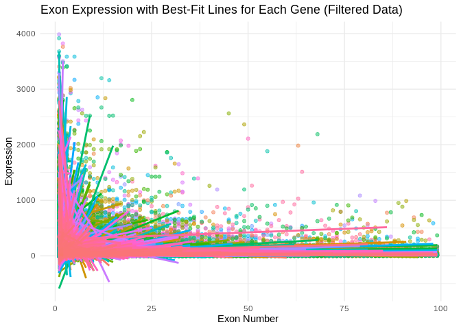
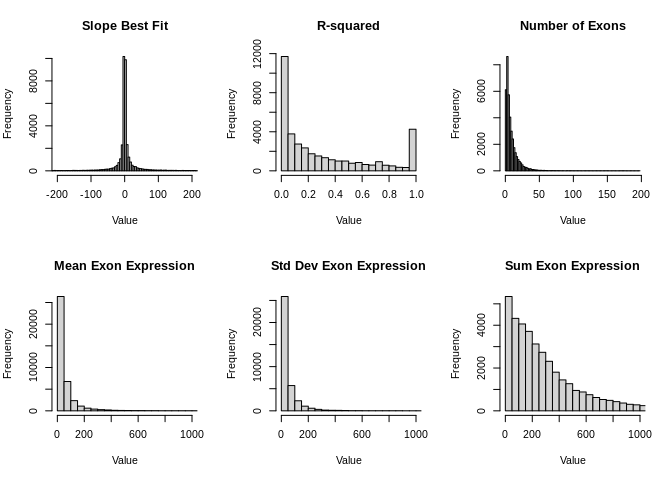
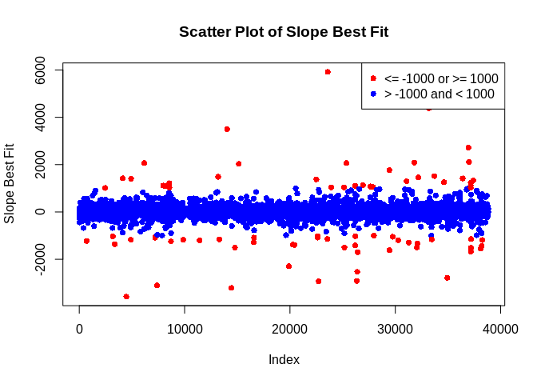

exon expression
================
2023-11-16

``` bash
head -5 ../output/19-exon-expression/S12M-exon_expression.tab > ../output/19-exon-expression/HEAD5-S12M-exon_expression.tab
```

``` r
library(readr)
library(dplyr)
```

    ## 
    ## Attaching package: 'dplyr'

    ## The following objects are masked from 'package:stats':
    ## 
    ##     filter, lag

    ## The following objects are masked from 'package:base':
    ## 
    ##     intersect, setdiff, setequal, union

``` r
library(broom)
library(tidyr)
library(purrr)

# Load the data
data <- read_delim("../output/19-exon-expression/S12M-exon_expression.tab", "\t", escape_double = FALSE, col_types = cols(), trim_ws = TRUE)
```

    ## Warning: One or more parsing issues, call `problems()` on your data frame for details,
    ## e.g.:
    ##   dat <- vroom(...)
    ##   problems(dat)

``` r
# Reshape data for linear regression analysis
data_long <- pivot_longer(data, cols = -gene_name, names_to = "exon", values_to = "expression")
data_long <- data_long %>% filter(!is.na(expression))

# Function to calculate the summary statistics for each gene
calculate_statistics <- function(df) {
  model <- lm(expression ~ as.numeric(gsub("exon_", "", exon)), data = df)
  slope <- coef(model)[2]
  r_squared <- summary(model)$r.squared
  predictions <- predict(model, interval = "confidence")
  df$within_ci <- df$expression >= predictions[, "lwr"] & df$expression <= predictions[, "upr"]
  percentage_within_ci <- mean(df$within_ci) * 100
  
  return(tibble(
    slope_best_fit = slope,
    r_squared = r_squared,
    percentage_within_95_CI = percentage_within_ci
  ))
}

# Apply function to each gene and calculate additional statistics
results <- data_long %>%
  group_by(gene_name) %>%
  nest() %>%
  mutate(
    statistics = map(data, calculate_statistics),
    num_exons = map_dbl(data, ~ nrow(.x)),
    mean_exon_expression = map_dbl(data, ~ mean(.x$expression, na.rm = TRUE)),
    std_dev_exon_expression = map_dbl(data, ~ sd(.x$expression, na.rm = TRUE)),
    sum_exon_expression = map_dbl(data, ~ sum(.x$expression, na.rm = TRUE))
  ) %>%
  select(-data) %>%
  unnest(statistics)
```

    ## Warning: There were 6151 warnings in `mutate()`.
    ## The first warning was:
    ## ℹ In argument: `statistics = map(data, calculate_statistics)`.
    ## ℹ In group 1: `gene_name = "gene-ATP6"`.
    ## Caused by warning in `qt()`:
    ## ! NaNs produced
    ## ℹ Run `dplyr::last_dplyr_warnings()` to see the 6150 remaining warnings.

``` r
# Save the results
write_csv(results, "../output/64-exon-expression/exon-summary.csv")

# Print the results
print(results)
```

    ## # A tibble: 38,838 × 8
    ## # Groups:   gene_name [38,838]
    ##    gene_name         slope_best_fit r_squared percentage_within_95_CI num_exons
    ##    <chr>                      <dbl>     <dbl>                   <dbl>     <dbl>
    ##  1 gene-LOC111116054         -60.5    0.907                     100           3
    ##  2 gene-LOC111126949          -2.00   0.00230                   100           5
    ##  3 gene-LOC111110729         -82.1    0.759                     100           4
    ##  4 gene-LOC111112434          49.5    0.868                     100           3
    ##  5 gene-LOC111120752           1.4    0.00586                   100           5
    ##  6 gene-LOC111128944          NA      0                          NA           1
    ##  7 gene-LOC111128953         -87.0    1                          NA           2
    ##  8 gene-LOC111105691          10.1    0.0825                     87.5         8
    ##  9 gene-LOC111105685         150      1                          NA           2
    ## 10 gene-LOC111105702          -0.2    0.100                     100           4
    ## # ℹ 38,828 more rows
    ## # ℹ 3 more variables: mean_exon_expression <dbl>,
    ## #   std_dev_exon_expression <dbl>, sum_exon_expression <dbl>

``` r
library(readr)
library(dplyr)
library(tidyr)
library(ggplot2)
library(purrr)

# Load the data
data <- read_delim("../output/19-exon-expression/S12M-exon_expression.tab", "\t", escape_double = FALSE, col_types = cols(), trim_ws = TRUE)
```

    ## Warning: One or more parsing issues, call `problems()` on your data frame for details,
    ## e.g.:
    ##   dat <- vroom(...)
    ##   problems(dat)

``` r
# Reshape data for analysis
data_long <- pivot_longer(data, cols = -gene_name, names_to = "exon", values_to = "expression")
data_long <- data_long %>% 
  filter(!is.na(expression), expression < 4000, as.numeric(gsub("exon_", "", exon)) < 100)

# Calculate mean exon expression for each gene
mean_expressions <- data_long %>%
  group_by(gene_name) %>%
  summarize(mean_expression = mean(expression, na.rm = TRUE)) %>%
  filter(mean_expression >= 10)

# Filter out genes with mean expression less than 10
data_long_filtered <- data_long %>% 
  semi_join(mean_expressions, by = "gene_name")

# Function to get regression line data
get_regression_line <- function(df) {
  model <- lm(expression ~ as.numeric(gsub("exon_", "", exon)), data = df)
  tibble(
    exon = as.numeric(gsub("exon_", "", df$exon)),
    predicted_expression = predict(model, newdata = df)
  )
}

# Calculate regression lines for each gene
regression_lines <- data_long_filtered %>%
  group_by(gene_name) %>%
  nest() %>%
  mutate(regression_data = map(data, get_regression_line)) %>%
  select(-data) %>%
  unnest(regression_data)
```

    ## Warning: There were 1966 warnings in `mutate()`.
    ## The first warning was:
    ## ℹ In argument: `regression_data = map(data, get_regression_line)`.
    ## ℹ In group 1: `gene_name = "gene-ATP6"`.
    ## Caused by warning in `predict.lm()`:
    ## ! prediction from a rank-deficient fit may be misleading
    ## ℹ Run `dplyr::last_dplyr_warnings()` to see the 1965 remaining warnings.

``` r
# Plotting
ggplot() +
  geom_point(data = data_long_filtered, aes(x = as.numeric(gsub("exon_", "", exon)), y = expression, color = gene_name), alpha = 0.5) +
  geom_line(data = regression_lines, aes(x = exon, y = predicted_expression, color = gene_name), size = 1) +
  theme_minimal() +
  labs(title = "Exon Expression with Best-Fit Lines for Each Gene (Filtered Data)",
       x = "Exon Number",
       y = "Expression") +
  theme(legend.position = "none")  # Remove legend if too many genes
```

    ## Warning: Using `size` aesthetic for lines was deprecated in ggplot2 3.4.0.
    ## ℹ Please use `linewidth` instead.
    ## This warning is displayed once every 8 hours.
    ## Call `lifecycle::last_lifecycle_warnings()` to see where this warning was
    ## generated.

<!-- -->

``` r
# Specify the file location
file_location <- "../output/64-exon-expression/exon-summary.csv"

# Read data from the specified file
data <- read.csv(file_location, header = TRUE, sep = ",")

# Check the structure of the data
str(data)
```

    ## 'data.frame':    38838 obs. of  8 variables:
    ##  $ gene_name              : chr  "gene-LOC111116054" "gene-LOC111126949" "gene-LOC111110729" "gene-LOC111112434" ...
    ##  $ slope_best_fit         : num  -60.5 -2 -82.1 49.5 1.4 ...
    ##  $ r_squared              : num  0.90728 0.0023 0.75891 0.86755 0.00586 ...
    ##  $ percentage_within_95_CI: num  100 100 100 100 100 NA NA 87.5 NA 100 ...
    ##  $ num_exons              : int  3 5 4 3 5 1 2 8 2 4 ...
    ##  $ mean_exon_expression   : num  80.7 78.8 102.8 62.3 60 ...
    ##  $ std_dev_exon_expression: num  63.5 65.9 121.7 53.1 28.9 ...
    ##  $ sum_exon_expression    : int  242 394 411 187 300 416 299 493 196 8 ...

``` r
# Create histograms for numeric variables
par(mfrow = c(2, 3))  # Arrange histograms in a 2x3 grid
hist(data$slope_best_fit, main = "Slope Best Fit", xlab = "Value", xlim = c(-200, 200), breaks = 2000)
hist(data$r_squared, main = "R-squared", xlab = "Value")
hist(data$num_exons, main = "Number of Exons", xlab = "Value", breaks = 100)
hist(data$mean_exon_expression, main = "Mean Exon Expression", xlab = "Value", breaks = 100, xlim = c(0, 1000))
hist(data$std_dev_exon_expression, main = "Std Dev Exon Expression", xlab = "Value", breaks = 100, xlim = c(0, 1000))
hist(data$sum_exon_expression, main = "Sum Exon Expression", xlab = "Value", breaks = 1000, xlim = c(0, 1000))
```

<!-- -->

``` r
# Reset the plotting layout
par(mfrow = c(1, 1))
```

``` r
# Specify the file location
file_location <- "../output/64-exon-expression/exon-summary.csv"
# Read data from the specified file
data <- read.csv(file_location, header = TRUE, sep = ",")

# Create a scatter plot for slope_best_fit with custom colors
plot(data$slope_best_fit, type = "p", pch = 16, 
     xlab = "Index", ylab = "Slope Best Fit", 
     main = "Scatter Plot of Slope Best Fit",
     col = ifelse(data$slope_best_fit > 1000 | data$slope_best_fit < -1000, "red", "blue"))

# Add a legend for the custom colors
legend("topright", legend = c("<= -1000 or >= 1000", "> -1000 and < 1000"), 
       col = c("red", "blue"), pch = 16)
```

<!-- -->

``` r
# Specify the file location
file_location <- "../output/64-exon-expression/exon-summary.csv"

# Read data from the specified file
data <- read.csv(file_location, header = TRUE, sep = ",")

# Filter the data based on conditions
filtered_data <- subset(data, r_squared > 0.6 & num_exons > 4)

# Now, filtered_data contains only the rows that meet the criteria.
```
