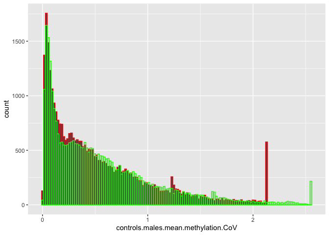

Plotting Methylation CoV
================

Plotting Methylation Variation

``` r
library(tidyverse)
```

    ── Attaching packages ─────────────────────────────────────── tidyverse 1.3.2 ──
    ✔ ggplot2 3.4.1     ✔ purrr   1.0.1
    ✔ tibble  3.1.8     ✔ dplyr   1.1.0
    ✔ tidyr   1.3.0     ✔ stringr 1.5.0
    ✔ readr   2.1.4     ✔ forcats 1.0.0
    ── Conflicts ────────────────────────────────────────── tidyverse_conflicts() ──
    ✖ dplyr::filter() masks stats::filter()
    ✖ dplyr::lag()    masks stats::lag()

``` r
controls_males_v_exposed_males_CoV_mean_methylation <- read_csv("../output/40-gene-methylation/controls.males_v_exposed.males.CoV-mean-methylation.csv")
```

    Rows: 38523 Columns: 4
    ── Column specification ────────────────────────────────────────────────────────
    Delimiter: ","
    chr (1): gene.id
    dbl (3): controls.males.mean.methylation.CoV, exposed.males.mean.methylation...

    ℹ Use `spec()` to retrieve the full column specification for this data.
    ℹ Specify the column types or set `show_col_types = FALSE` to quiet this message.

``` r
structure(controls_males_v_exposed_males_CoV_mean_methylation)
```

    # A tibble: 38,523 × 4
       gene.id           controls.males.mean.methylation.CoV exposed.males…¹ abs.d…²
       <chr>                                           <dbl>           <dbl>   <dbl>
     1 gene-ATP6                                       0.603           0.816 0.213  
     2 gene-COX1                                       0.484           0.330 0.154  
     3 gene-COX2                                       0.355           0.562 0.207  
     4 gene-COX3                                       0.304           0.305 0.00118
     5 gene-CYTB                                       0.446           0.339 0.107  
     6 gene-LOC111099029                               0.269           0.139 0.130  
     7 gene-LOC111099030                               1.05            0.790 0.260  
     8 gene-LOC111099031                               0.312           0.626 0.314  
     9 gene-LOC111099032                               0.224           0.588 0.363  
    10 gene-LOC111099033                               0.548           0.485 0.0637 
    # … with 38,513 more rows, and abbreviated variable names
    #   ¹​exposed.males.mean.methylation.CoV, ²​abs.delta.CoV

``` r
ggplot(controls_males_v_exposed_males_CoV_mean_methylation) +
  geom_histogram(aes(x = controls.males.mean.methylation.CoV), bins = 140, color = "red") +
  geom_histogram(aes(x = exposed.males.mean.methylation.CoV), bins = 140, alpha = 0.2, color = "green")
```

    Warning: Removed 3662 rows containing non-finite values (`stat_bin()`).

    Warning: Removed 4154 rows containing non-finite values (`stat_bin()`).



``` r
ggplot(controls_males_v_exposed_males_CoV_mean_methylation) +
  geom_histogram(aes(x = abs.delta.CoV), bins = 2050)
```

    Warning: Removed 4959 rows containing non-finite values (`stat_bin()`).


